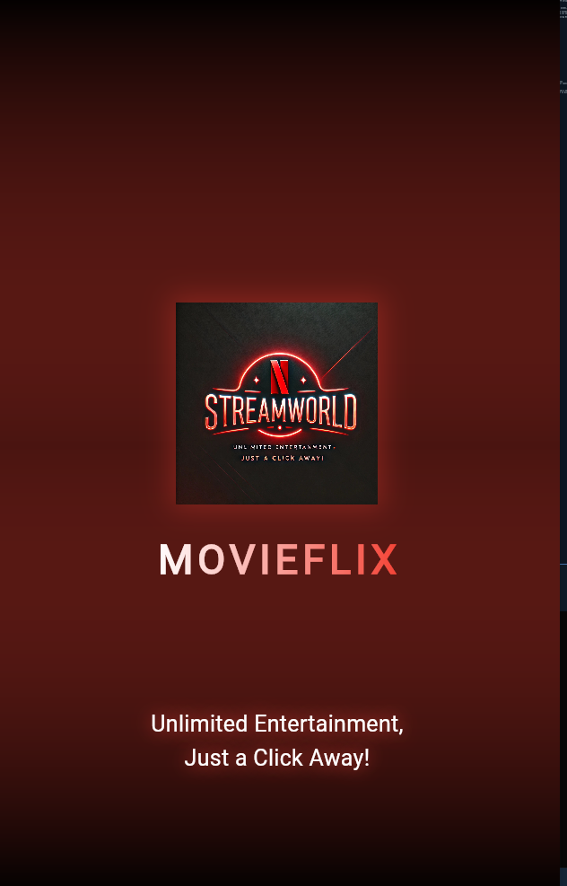

# Movie Flix

Welcome to **Movie Flix**, a Flutter-based application that provides users with an immersive experience to explore a vast collection of movies, animes, TV serials, and more. 

## Features

- **Browse Movies and More**: Discover a variety of movies, animes, and TV serials with detailed categorization.
- **Search Functionality**: Quickly search for your favorite titles.
- **Detailed Information**: Tap on any movie or show to view its in-depth details, including the plot, genres, runtime, and ratings.
- **User-Friendly Interface**: A seamless and visually appealing UI inspired by Netflix.

## Project Setup

To run this project locally, follow these steps:

1. **Clone the Repository**:
   ```bash
   git clone https://github.com/your-repo/movie-flix.git
   ```
2. **Navigate to the Project Directory**:
   ```bash
   cd movie-flix
   ```
3. **Install Dependencies**:
   ```bash
   flutter pub get
   ```
4. **Run the Application**:
   ```bash
   flutter run
   ```

## Screenshots




## Tech Stack

- **Framework**: Flutter
- **Language**: Dart
- **Packages**: 
  - [http](https://pub.dev/packages/http) for API interactions
  - [url_launcher](https://pub.dev/packages/url_launcher) for launching URLs

## Contributing

Contributions are welcome! Please fork this repository, create a new branch, and submit a pull request. For significant changes, please open an issue first to discuss what you would like to change.

---

Enjoy exploring movies and more with **Movie Flix**!
